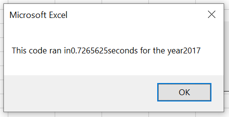
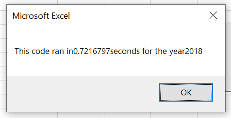
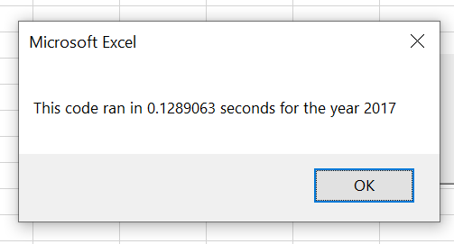
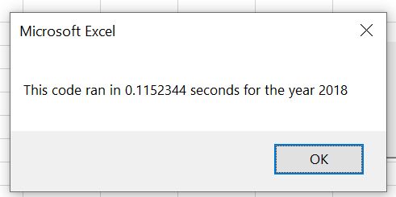
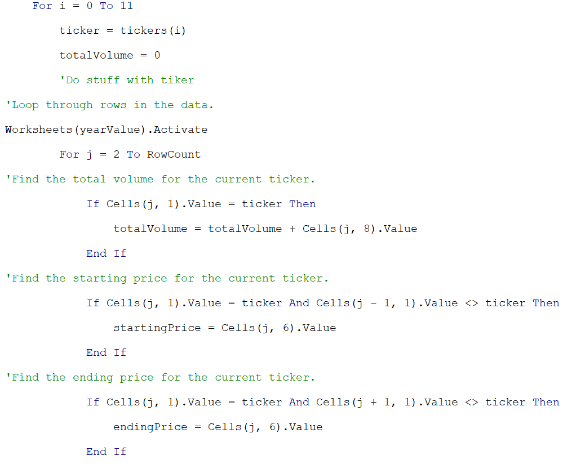
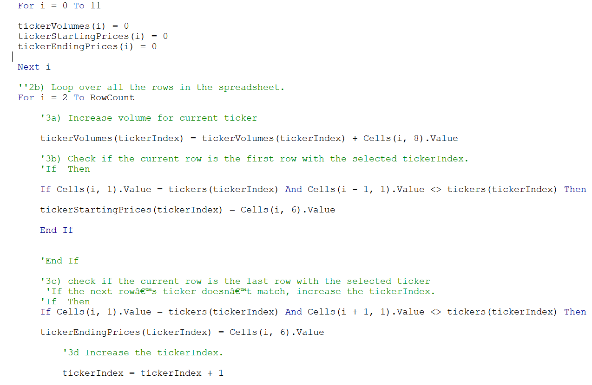
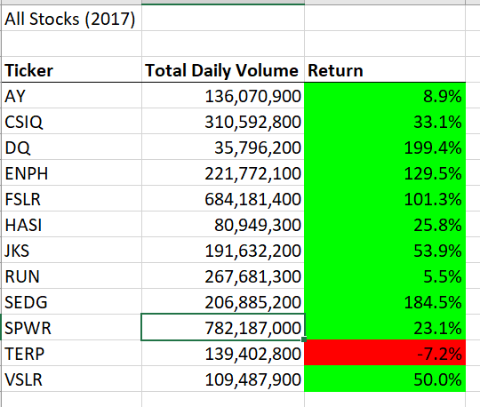
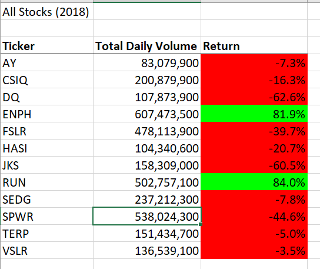

# Stocks-Analysis

## Overview of the project
We have been trying to create a series of code that would put the stocks' numbers together for Steve. Now, he would like to gain more information for the entire stock market, which requires us to design a code that works well with an expanded dataset. Previously, we used the nested loops to generate the total daily trading volumes and yearly return for different stocks based on different years (2017 and 2018). However, when working with a large dataset, the time elasped for running the code becomes significant. Therefore, the purpose of this project is to improve the efficiency of the program by refactoring the code we developed earlier.

## Results
The analysis was performed in the follwing Excel document:[VBA_Challenge.xlsm](VBA_Challenge.xlsm)

### Comparison of Time Elapsed
Firstly, we can compare the time spent for running the code before and after the refactoring.

  

(Time spent running the original script)

  

(Time spent running the refactored script)

We could clearly see that the time was reduced from about 0.72 seconds to about 0.12 seconds, which is a 5/6 reduction in time. 

### Change of Method
To briefly explain the cause of the time reduction, it was due to the change of method. As I mentioned above, the nested loops were used in the original script, as shown below:

 

There was a `For` loop inside of the `For` loop, and this requires the program to finish the inner loop before running the outer loop. In comparison, during the refactoring of script, we created three output arrays in addition to the `kickers`. Besides. we also adopted a variable called `kickerIndex`, which enabled the accesses to the correct index across the four different arrays, as shown below:

 

The new method allowed the program to run different loops at the same time, as all the outputs were generated based on the key variable `kickersIndex`.

### Stock Performance Comparison

  

As we have conditional formatted the cells, we could clearly see by the color that the stock market did much better in 2017 than in 2018. Not only most stocks achieved positive return in 2017, the percentages they grew were very significant (some over 100%; Some closed to 200%). In contrast, when we take a look at 2018's data, we could only see two stocks grow in the year. However, this comparison is only based on the stock data we were given for the two years. Therefore, it is possible that the stocks Steve picked couldn't represent the true performance of the entire stock market. (Indeed, if the 2017 stocks we see here could roughly present the real performance of the entire market, I would say it was bullish year. Woohoo!)

## Summary
- What are the advantages and disadvantages of refactoring code in general?

  Advantages:

  1) Improve the efficiency of the program.
  2) Good practice opportunities: help improve use of different functions, understand the logic.
  3) Help develop our problem solving skills: one methods won't always work. Therefore, when we encounter problems, we can try to avoid them by switching methods.

    Disadvantages:

  1) It could be time consuming when developing the codes.
  2) Some complicated methods may confuse ourselves.

- What are the advantages and disadvantages of the original and refactored VBA script?

  Advantages:

  1) It became more efficient when running large dataset after refactoring.
  2) The entire refactoring process was a good practice oppotunity.

    Disadvantages:

  1) It was very time consuming for me to understand the second method.
  2) I made a lot of mistakes and spent much time trying to debug many line of code when refactoring.
  3) The refactored script was not as straight forward as the original one, therefore, it could be more difficult to be reused in the future.

